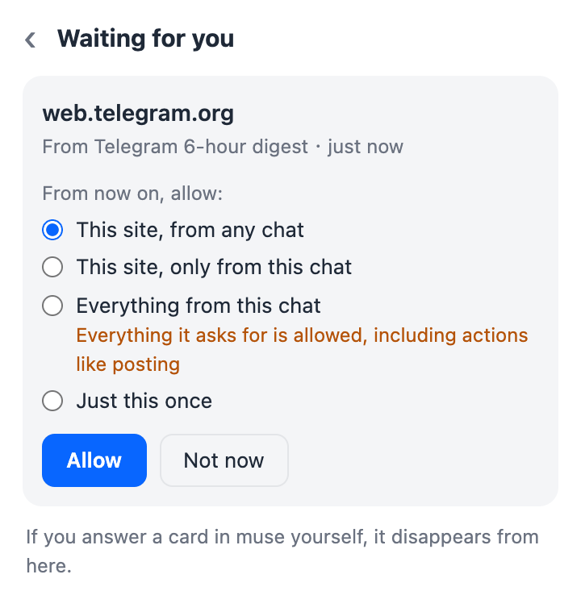
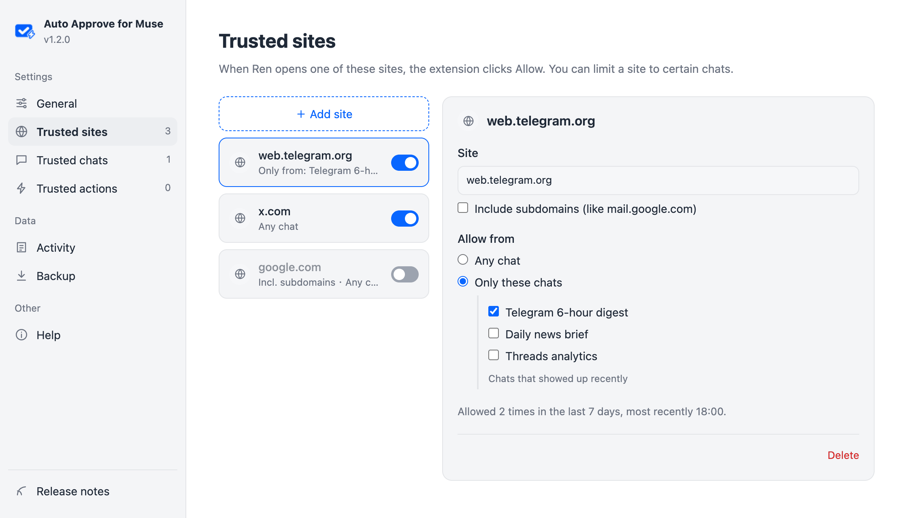

<p align="center">
  
</p>

<h1 align="center">Auto Approve for Muse</h1>

<p align="center">
  <a href="https://chromewebstore.google.com/detail/hbcimibdadjhancbpjibbhnhlcflmoii"></a>
</p>

<p align="center"><a href="README.zh-TW.md">繁體中文</a></p>

When the muse.ai assistant tries to open a new or sensitive website, it shows an approval card and waits for you to click "Allow". If nobody is around, the task just sits there, which happens a lot with scheduled tasks.

This Chrome extension clicks Allow for you. You can let it approve everything, or only the sites, actions, and chats you trust. If the card offers "Always allow", it picks that one, so the same site won't ask again.

> This is an unofficial tool and is not affiliated with Meta or muse.ai. Auto-approving removes the human check on what the assistant can access, so make sure you're fine with that.

## Install

Install it from the [Chrome Web Store](https://chromewebstore.google.com/detail/hbcimibdadjhancbpjibbhnhlcflmoii). The store version updates automatically.

If you'd rather not use the store, the install script and the manual steps below load the same extension from this repo. Pick one way. If you install both, two copies run on the same page.

### Install script

macOS / Linux:

```bash
curl -fsSL https://raw.githubusercontent.com/homieyangg/muse-auto-approve/main/install.sh | bash
```

Windows (PowerShell):

```powershell
irm https://raw.githubusercontent.com/homieyangg/muse-auto-approve/main/install.ps1 | iex
```

The script downloads the latest release to `~/muse-auto-approve` (`%USERPROFILE%\muse-auto-approve` on Windows), opens `chrome://extensions`, and copies the folder path to your clipboard. Chrome doesn't let scripts install extensions on their own, so you still need to do steps 2 and 3 below. When the folder picker opens, paste the path instead of browsing for it.

Run the same command again to update. The folder stays the same, so your settings are kept. After updating, click the reload icon on the extension's card in `chrome://extensions`.

### Manual install

1. Clone or download this repo. If you download the ZIP, unzip it first.
2. Open `chrome://extensions` and turn on Developer mode in the top right corner.

   

3. Click "Load unpacked" and select the folder that contains `manifest.json`. Auto Approve for Muse then shows up in the list.

   

4. Reload any open muse.ai tabs, then click the extension's toolbar icon to check that it's on. If the icon isn't in the toolbar, click the puzzle piece icon and pin it.

   

The interface is in English and Traditional Chinese and follows your browser language. You can change it in Settings.

## Trusted sites and chats

After you install it, a welcome page asks how it should work. "Only what I trust" is the recommended choice. "Allow everything" clicks every card, like version 1.0 did. If you're updating from 1.0, it stays on "Allow everything" until you change it.

With "Only what I trust", a card for a site you haven't trusted yet is left alone and the toolbar icon shows a red number. Open the popup, tap the request, and pick how far to trust it:



- This site, from any chat
- This site, only from this chat
- Everything from this chat. Anything that chat asks for gets allowed, including posts and messages, so keep this for scheduled tasks you're sure about.
- Just this once, without remembering anything

The card gets clicked right away, and from then on matching cards are approved without asking. A card is approved if it comes from a trusted chat, or if its site or action is trusted and either has no chat limit or the card came from one of the chats it's limited to.

Some cards aren't about opening a website. They ask Ren to do something, like posting to Threads or sending a message. For those, the popup offers "This action" instead of "This site", and the action is remembered by the card's title. "Allow everything" leaves action cards alone unless you turn on "Include actions" under Settings > General > Advanced, because a post or a message can't be taken back.

Settings has the full lists. You can limit a site to certain chats, turn an entry off without deleting it, check the activity log, and export or import your settings.



## How it finds approval cards

- muse marks its approval cards with `data-testid="hatch-inline-approval-card"`, and the extension only clicks Allow or Always allow inside a marked card, so an Allow button anywhere else on the page is never clicked.
- If muse ever drops that marker, it falls back to looking for Deny and Allow buttons in the same block, and only when the card text mentions a website, access, the browser, or permissions. Unrelated dialogs such as a delete confirmation are left alone.
- An approval that comes from another chat only shows up as a banner with a Review button. The extension clicks Review to open the card, then approves it.
- It won't click the same card twice within 5 seconds, and it clicks Review at most once every 10 seconds. If the card behind a banner isn't trusted, it leaves the banner alone for 10 minutes instead of opening it again and again.

It has only been tested with the Traditional Chinese UI. English and Simplified Chinese button labels are in the matching rules but haven't been tested on the live site.

## Limitations

- A muse.ai tab has to stay open. If you close it, nothing gets approved.
- In "Allow everything" mode it approves every website card, and action cards too if you turn that on.
- Actions are matched by the card title. Trusting "post to Threads" covers every post, whatever the text or account.
- Cards that appear inside the chat that started the task often don't say which chat they came from, so the "only from this chat" options aren't offered for them.
- A muse.ai redesign can break the matching. Button labels and the markup of the review banner are the parts most likely to change.

## Running it around the clock

If your computer doesn't stay on, you can run Chromium on a server with the extension loaded. `deploy/compose.yml` uses [linuxserver/chromium](https://github.com/linuxserver/docker-chromium) and runs on both amd64 and arm64.

```bash
cd deploy
docker compose up -d
```

You need to sign in to muse.ai once through the web UI. The compose file binds it to `127.0.0.1:13000` on the server, so connect through an SSH tunnel:

```bash
ssh -L 13000:127.0.0.1:13000 <your-server>
# then open http://localhost:13000
```

Once you're signed in, you can close the page and the SSH session. Chromium keeps running on the server, and the login is stored in the `muse-browser-config` Docker volume.

A few things to keep in mind:

- The web UI includes a terminal with passwordless sudo. Never expose the port to the internet.
- Chromium in the container defaults to English, and muse.ai follows the browser language. The compose file passes `--lang=zh-TW` because that's the UI the extension was tested with. After signing in, also set Chromium's language to Traditional Chinese and turn off page translation, since a translated page changes the button labels the extension looks for.
- Streaming the web UI takes a fair amount of CPU, so close it when you're done.
- Chromium on the server isn't signed in to Google, so your trusted lists don't sync to it. Export them from Settings > Backup in your own browser and import the file on the server.
- After updating the extension, run `docker compose restart` so Chromium loads the new version.

## Privacy

The extension has no server and makes no network requests of its own. Your mode and trusted lists are saved with `chrome.storage.sync`, so Chrome syncs them between browsers signed in to the same Google account. The activity log stays in `chrome.storage.local` on your computer. See [PRIVACY.md](PRIVACY.md) for details.

## Packaging

```bash
./scripts/pack.sh
```

This writes a zip for the Chrome Web Store to `dist/`, containing only the files the extension needs.

## License

MIT
