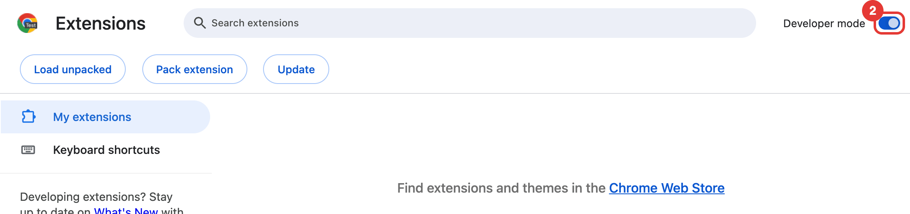
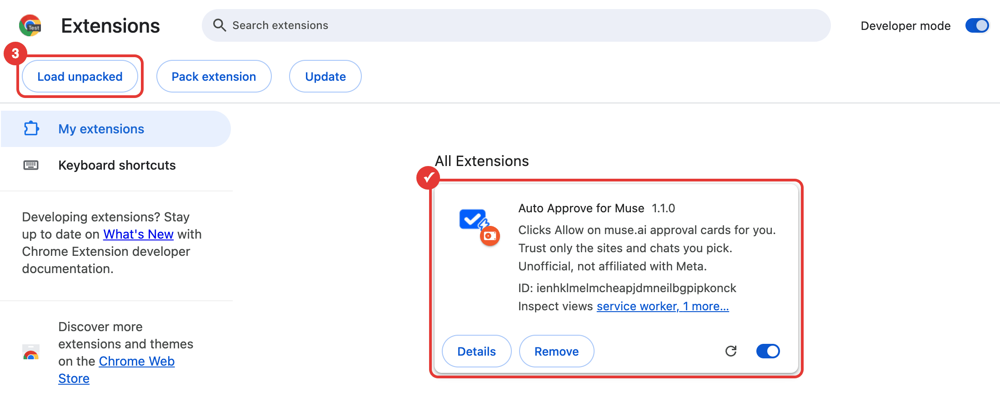
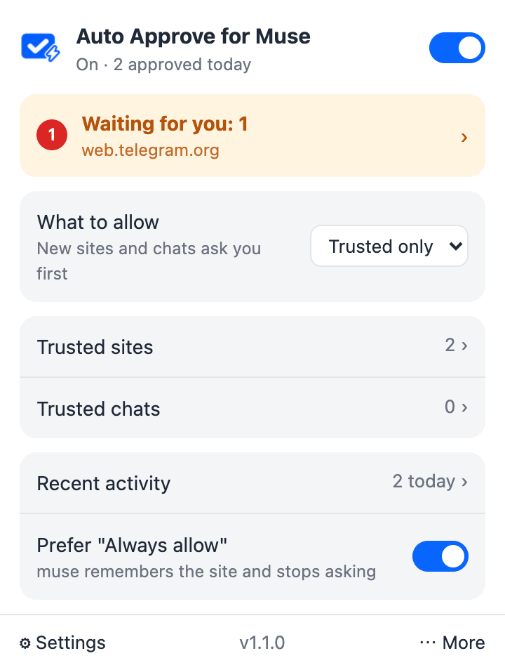

<p align="center">
  
</p>

<h1 align="center">Auto Approve for Muse</h1>

<p align="center"><a href="README.zh-TW.md">繁體中文</a></p>

When the muse.ai assistant tries to open a new or sensitive website, it shows an approval card and waits for you to click "Allow". If nobody is around, the task just sits there, which happens a lot with scheduled tasks.

This Chrome extension clicks Allow for you. If the card offers "Always allow", it picks that one, so the same site won't ask again.

> This is an unofficial tool and is not affiliated with Meta or muse.ai. Auto-approving removes the human check on what the assistant can access, so make sure you're fine with that.

## Install

The Chrome Web Store listing is under review. The link will go here once it's approved. Until then, use the install script or load it manually.

### Install script

macOS / Linux:

```bash
curl -fsSL https://raw.githubusercontent.com/homieyangg/muse-auto-approve/main/install.sh | bash
```

Windows (PowerShell):

```powershell
irm https://raw.githubusercontent.com/homieyangg/muse-auto-approve/main/install.ps1 | iex
```

The script downloads the latest release to `~/muse-auto-approve` (`%USERPROFILE%\muse-auto-approve` on Windows), opens `chrome://extensions`, and copies the folder path to your clipboard. Chrome doesn't let scripts install extensions on their own, so you still need to do steps 2 and 3 below. When the folder picker opens, paste the path instead of browsing for it.

Run the same command again to update. The folder stays the same, so your settings are kept. After updating, click the reload icon on the extension's card in `chrome://extensions`.

### Manual install

1. Clone or download this repo. If you download the ZIP, unzip it first.
2. Open `chrome://extensions` and turn on Developer mode in the top right corner.

   

3. Click "Load unpacked" and select the folder that contains `manifest.json`. Auto Approve for Muse then shows up in the list.

   

4. Reload any open muse.ai tabs, then click the extension's toolbar icon to check that it's on. If the icon isn't in the toolbar, click the puzzle piece icon and pin it.

   

The popup lets you pause it, choose whether to prefer "Always allow", and see the last 20 cards it approved. It's only in Traditional Chinese for now.

## How it decides what to click

- It starts from the Deny button and looks for Allow or Always allow in the same block, so an Allow button anywhere else on the page is never clicked.
- The card itself has to mention a website, access, the browser, or permissions. Unrelated dialogs such as a delete confirmation are left alone.
- An approval that comes from another chat only shows up as a banner with a Review button. The extension clicks Review to open the card, then approves it.
- It won't click the same card twice within 5 seconds, and it clicks Review at most once every 10 seconds.

It has only been tested with the Traditional Chinese UI. English and Simplified Chinese button labels are in the matching rules but haven't been tested on the live site.

## Limitations

- A muse.ai tab has to stay open. If you close it, nothing gets approved.
- It approves every card that matches, whatever the site or action.
- A muse.ai redesign can break the matching. Button labels and the markup of the review banner are the parts most likely to change.

## Running it around the clock

If your computer doesn't stay on, you can run Chromium on a server with the extension loaded. `deploy/compose.yml` uses [linuxserver/chromium](https://github.com/linuxserver/docker-chromium) and runs on both amd64 and arm64.

```bash
cd deploy
docker compose up -d
```

You need to sign in to muse.ai once through the web UI. The compose file binds it to `127.0.0.1:13000` on the server, so connect through an SSH tunnel:

```bash
ssh -L 13000:127.0.0.1:13000 <your-server>
# then open http://localhost:13000
```

Once you're signed in, you can close the page and the SSH session. Chromium keeps running on the server, and the login is stored in the `muse-browser-config` Docker volume.

A few things to keep in mind:

- The web UI includes a terminal with passwordless sudo. Never expose the port to the internet.
- Chromium in the container defaults to English, and muse.ai follows the browser language. The compose file passes `--lang=zh-TW` because that's the UI the extension was tested with. After signing in, also set Chromium's language to Traditional Chinese and turn off page translation, since a translated page changes the button labels the extension looks for.
- Streaming the web UI takes a fair amount of CPU, so close it when you're done.
- After updating the extension, run `docker compose restart` so Chromium loads the new version.

## Privacy

The extension never sends anything out of your browser. Settings and the last 20 approval records are kept in `chrome.storage.local`. See [PRIVACY.md](PRIVACY.md) for details.

## Packaging

```bash
./scripts/pack.sh
```

This writes a zip for the Chrome Web Store to `dist/`, containing only the files the extension needs.

## License

MIT
