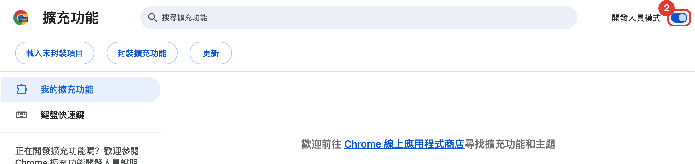
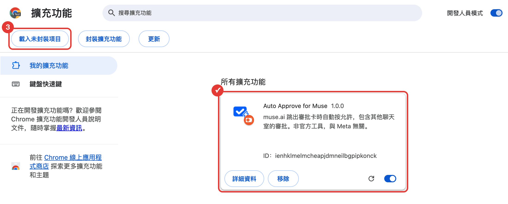
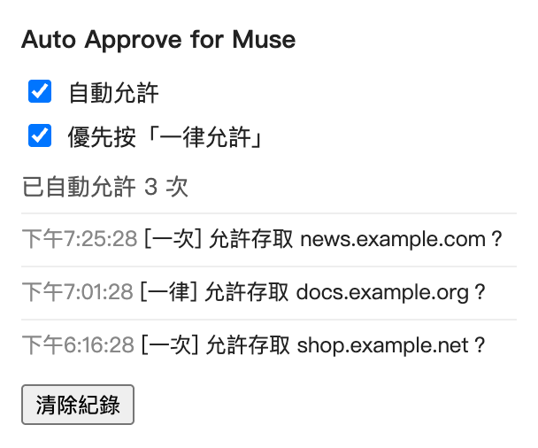

<p align="center">
  
</p>

<h1 align="center">Auto Approve for Muse</h1>

<p align="center"><a href="README.md">English</a></p>

muse.ai 的助理存取新網站或敏感網站時，會跳一張審批卡等你按「允許」。沒人按，任務就卡在那裡，排程任務特別常遇到。

這個 Chrome 插件看到審批卡就自動按允許。有「一律允許」時優先按它，之後同一個網站就不會再問。

> 非官方工具，與 Meta、muse.ai 無關。自動允許等於關掉人工確認這一關，請自行評估風險。

## 安裝

從 Chrome 網上應用程式商店安裝（上架後補連結），或自己載入：

1. 下載或 clone 這個 repo。下載 ZIP 的話要先解壓縮。
2. Chrome 開 `chrome://extensions`，打開右上角「開發人員模式」。

   

3. 按「載入未封裝項目」，選有 `manifest.json` 的那個資料夾。載入後清單裡會出現 Auto Approve for Muse。

   

4. 重新整理 muse.ai 分頁，再點工具列上的插件圖示確認有開著。工具列上沒看到圖示的話，點拼圖圖示把它釘選出來。

   

popup 可以暫停自動允許、切換是否優先按「一律允許」，也看得到最近 20 筆按過的卡片。

## 怎麼判斷審批卡

- 先找「拒絕 / Deny」按鈕，再找同一區塊裡的「一律允許」或「允許」。卡片外的「允許」不會被點到。
- 卡片本身的文字要提到網站、存取、瀏覽器、權限這類字眼才會按，刪除確認這類對話框不會動。
- 審批來自別的聊天室時，目前畫面只會顯示「一項工作需要檢閱」。插件會先按「檢閱」把卡片叫出來，再按允許。
- 同一張卡 5 秒內不會重按，「檢閱」最多 10 秒按一次。

目前只在繁體中文介面實際測過，英文和簡體的按鈕文字有列進判斷，但沒有實測。

## 限制

- muse.ai 的分頁要開著才有用，關掉就沒人按了。
- 符合條件的審批卡都會按，不分網站或動作類型。
- muse 改版可能讓判斷失效，最可能出問題的是按鈕文字和「檢閱」提示的結構。

## 讓它 24 小時跑

電腦會關機的話，可以在自己的 server 上跑一個常駐的 Chromium，把插件載進去。`deploy/compose.yml` 是用 [linuxserver/chromium](https://github.com/linuxserver/docker-chromium) 的範例，amd64 和 arm64 都能跑。

```bash
cd deploy
docker compose up -d
```

第一次要從網頁介面登入 muse.ai。compose 只把介面綁在 server 的 `127.0.0.1:13000`，從自己電腦用 SSH tunnel 連進去：

```bash
ssh -L 13000:127.0.0.1:13000 <your-server>
# 瀏覽器開 http://localhost:13000
```

登入完關掉網頁、斷開 SSH 都沒關係，Chromium 會繼續在 server 上跑。登入狀態存在 docker volume `muse-browser-config`。

幾個要注意的地方：

- 網頁介面裡有一個免密碼 sudo 的 terminal，不要把 port 對外開放。
- 遠端 Chromium 預設是英文，muse 會跟著變英文介面。compose 已經加了 `--lang=zh-TW`，但第一次登入後最好再到 Chromium 設定把語言改成繁體中文、關掉翻譯，避免頁面被翻成英文，插件就認不到按鈕。
- 網頁介面開著時會即時壓縮畫面串流，CPU 用量比較高，看完就關掉。
- 更新插件後要 `docker compose restart`，Chromium 才會載入新版。

## 隱私

插件不會把任何資料送出瀏覽器。設定和最近 20 筆紀錄只存在 `chrome.storage.local`。詳見 [PRIVACY.md](PRIVACY.md)。

## 打包

```bash
./scripts/pack.sh
```

會在 `dist/` 產出上架用的 zip，只包含插件本身需要的檔案。

## License

MIT
