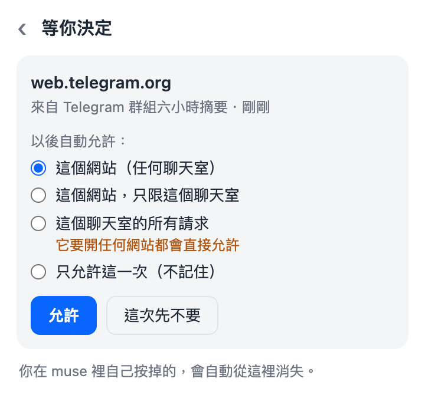
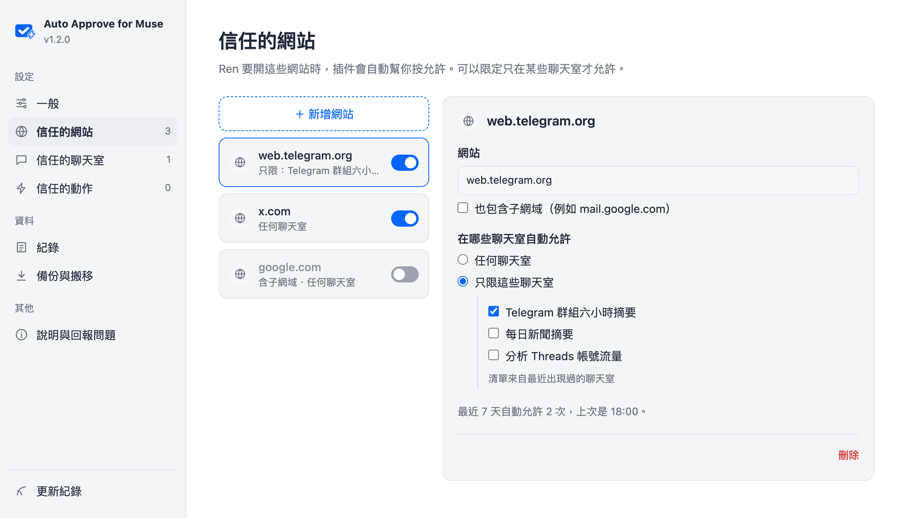

<p align="center">
  
</p>

<h1 align="center">Auto Approve for Muse</h1>

<p align="center">
  <a href="https://chromewebstore.google.com/detail/hbcimibdadjhancbpjibbhnhlcflmoii"></a>
</p>

<p align="center"><a href="README.md">English</a></p>

muse.ai 的助理存取新網站或敏感網站時，會跳一張審批卡等你按「允許」。沒人按，任務就卡在那裡，排程任務特別常遇到。

這個 Chrome 插件看到審批卡就自動幫你按允許。可以全部都按，也可以只按你信任的網站、動作和聊天室。有「一律允許」時優先按它，之後同一個網站就不會再問。

> 非官方工具，與 Meta、muse.ai 無關。自動允許等於關掉人工確認這一關，請自行評估風險。

## 安裝

從 [Chrome 線上應用程式商店](https://chromewebstore.google.com/detail/hbcimibdadjhancbpjibbhnhlcflmoii) 安裝，商店版會自動更新。

不想用商店的話，下面的安裝腳本和手動安裝載入的是同一個插件，只是從這個 repo 來。兩種擇一就好，兩個都裝的話同一個頁面會有兩份在跑。

### 安裝腳本

macOS / Linux：

```bash
curl -fsSL https://raw.githubusercontent.com/homieyangg/muse-auto-approve/main/install.sh | bash
```

Windows（PowerShell）：

```powershell
irm https://raw.githubusercontent.com/homieyangg/muse-auto-approve/main/install.ps1 | iex
```

腳本會把最新版下載到 `~/muse-auto-approve`（Windows 是 `%USERPROFILE%\muse-auto-approve`），幫你打開 `chrome://extensions`，並把資料夾路徑複製到剪貼簿。Chrome 不允許程式自己安裝插件，所以下面的步驟 2 和 3 還是要自己按；跳出選資料夾的視窗時，直接貼上路徑就好，不用一層層找。

之後要更新，再跑一次同一個指令就好。資料夾位置不變，設定會保留。更新完到 `chrome://extensions` 按一下插件卡片上的重新載入圖示。

### 手動安裝

1. 下載或 clone 這個 repo。下載 ZIP 的話要先解壓縮。
2. Chrome 開 `chrome://extensions`，打開右上角「開發人員模式」。

   

3. 按「載入未封裝項目」，選有 `manifest.json` 的那個資料夾。載入後清單裡會出現 Auto Approve for Muse。

   

4. 重新整理 muse.ai 分頁，再點工具列上的插件圖示確認有開著。工具列上沒看到圖示的話，點拼圖圖示把它釘選出來。

   

介面有繁體中文和英文，預設跟著瀏覽器的語言，也可以在設定頁切換。

## 信任的網站和聊天室

裝好之後會跳出歡迎頁，問你要怎麼處理。推薦選「只允許我信任的」；選「全部自動允許」的話，每張卡都會按，跟 1.0 版一樣。從 1.0 版更新上來的人會維持「全部自動允許」，要自己去改才會變。

選「只允許我信任的」時，還沒信任過的網站，插件不會按，工具列圖示上會出現紅色數字。點開 popup，點那筆請求，選要信任到什麼範圍：



- 這個網站（任何聊天室）
- 這個網站，只限這個聊天室
- 這個聊天室的所有請求：它要開任何網站、發文、傳訊息都會直接允許，只給你很確定的排程用
- 只允許這一次，不記住

選好後那張卡會馬上被按掉，之後符合的卡就直接允許。判斷方式是：來自信任的聊天室；或網站、動作在信任清單裡，而且沒限定聊天室，或來源正好是它限定的聊天室。

有些卡不是要開網站，而是要 Ren 做一件事，例如發文到 Threads、傳訊息。這種卡在 popup 裡的選項是「這個動作」，插件用卡片標題記住這個動作。「全部自動允許」預設不會按這種動作卡，因為發出去的文章和訊息收不回來；要一起按的話，到「設定 → 一般 → 進階」打開「全部允許時也按動作卡」。

要信任聊天室時，可以直接從 muse 的副聊天室挑。在 muse 打開左邊的聊天室清單一次，插件就會記下名稱，不用自己打字。

設定頁有完整的清單。可以把網站限定在某些聊天室、先停用某一筆但不刪掉、看紀錄，還有匯出匯入設定。



## 怎麼找到審批卡

- muse 會把審批卡標上 `data-testid="hatch-inline-approval-card"`，插件只在有這個標記的卡片裡按「一律允許」或「允許」，卡片外的「允許」不會被點到。
- 萬一 muse 拿掉這個標記，會改用舊的判斷：同一區塊裡要有「拒絕」和「允許」，而且卡片文字要提到網站、存取、瀏覽器、權限這類字眼才會按，刪除確認這類對話框不會動。
- 審批來自別的聊天室時，目前畫面只會顯示「一項工作需要檢閱」。插件會先按「檢閱」把卡片叫出來，再按允許。
- 同一張卡 5 秒內不會重按，「檢閱」最多 10 秒按一次。叫出來的卡如果不在信任清單裡，同一個提示 10 分鐘內不會再一直點開。

目前只在繁體中文介面實際測過，英文和簡體的按鈕文字有列進判斷，但沒有實測。

## 限制

- muse.ai 的分頁要開著才有用，關掉就沒人按了。
- 「全部自動允許」模式下，存取網站的卡都會按；動作卡要另外打開開關才會按。
- 動作是用卡片標題比對的。信任「發文到 Threads」之後，不管內容或帳號，發文都會自動允許。
- 在發起任務的那個聊天室裡直接跳出來的卡，通常沒寫來自哪個聊天室，所以不會有「只限這個聊天室」的選項。
- muse 改版可能讓判斷失效，最可能出問題的是按鈕文字和「檢閱」提示的結構。

## 讓它 24 小時跑

電腦會關機的話，可以在自己的 server 上跑一個常駐的 Chromium，把插件載進去。`deploy/compose.yml` 是用 [linuxserver/chromium](https://github.com/linuxserver/docker-chromium) 的範例，amd64 和 arm64 都能跑。

```bash
cd deploy
docker compose up -d
```

第一次要從網頁介面登入 muse.ai。compose 只把介面綁在 server 的 `127.0.0.1:13000`，從自己電腦用 SSH tunnel 連進去：

```bash
ssh -L 13000:127.0.0.1:13000 <your-server>
# 瀏覽器開 http://localhost:13000
```

登入完關掉網頁、斷開 SSH 都沒關係，Chromium 會繼續在 server 上跑。登入狀態存在 docker volume `muse-browser-config`。

幾個要注意的地方：

- 網頁介面裡有一個免密碼 sudo 的 terminal，不要把 port 對外開放。
- 遠端 Chromium 預設是英文，muse 會跟著變英文介面。compose 已經加了 `--lang=zh-TW`，但第一次登入後最好再到 Chromium 設定把語言改成繁體中文、關掉翻譯，避免頁面被翻成英文，插件就認不到按鈕。
- 網頁介面開著時會即時壓縮畫面串流，CPU 用量比較高，看完就關掉。
- server 上的 Chromium 沒有登入 Google，信任清單不會同步過去。在自己的瀏覽器從「設定 → 備份與搬移」匯出，再到 server 上匯入。
- 更新插件後要 `docker compose restart`，Chromium 才會載入新版。

## 隱私

插件沒有伺服器，自己不會發任何網路請求。模式和信任清單存在 `chrome.storage.sync`，登入同一個 Google 帳號的 Chrome 會透過 Chrome 同步；紀錄只存在這台電腦的 `chrome.storage.local`。詳見 [PRIVACY.md](PRIVACY.md)。

## 打包

```bash
./scripts/pack.sh
```

會在 `dist/` 產出上架用的 zip，只包含插件本身需要的檔案。

## License

MIT
